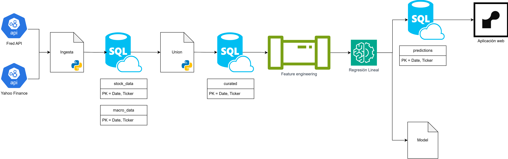
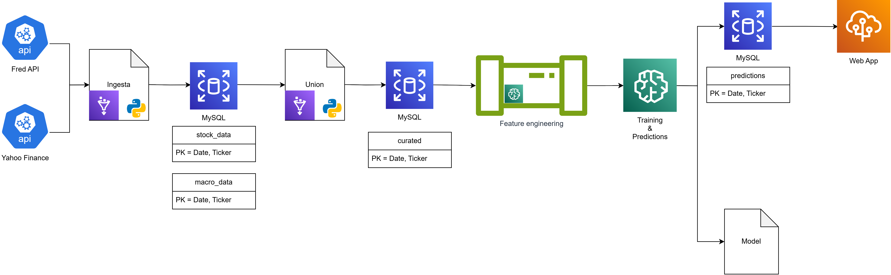

# 
Arquitectura

Este documento describe la arquitectura del proyecto de predicción del riesgo del activo financiero S&P500, incluyendo la ingesta de datos, transformación, feature engineering, modelado, predicciones y la aplicación web. También se incluye una arquitectura recomendada para desplegar el proyecto en AWS.

    

 

## Ingesta de datos
El proceso de ingesta está centralizado en el script `data/etl/sor_to_rdz/ingesta.py`, que coordina la descarga y carga de datos desde dos fuentes principales:
- Yahoo Finance: Datos de precios históricos de acciones (S&P500).
- FRED (Federal Reserve Economic Data): Variables macroeconómicas.

El mismo código luego almacena los datos en una base de datos MySQL en dos tablas:
- `stock_data` (para Yahoo Finance)
- `macro_data` (para FRED

## Transformación inicial
Una vez los datos están almacenados, se realiza un proceso de unión entre ambas fuentes para generar una tabla consolidada `curated`.

En esta tabla se devuelven todas las columnas de ambas tablas unidas, ademas de las variables objetivo que son `Target5`, `Target10` y `Target30`. 

## Feature engineering
Sobre la tabla curated, se aplican transformaciones adicionales para enriquecer el conjunto de datos (feature engineering). Estas transformaciones son las siguientes:

- trans 1
- trans 2
- trans 3

Algunas de estas transformaciones fueron desarrolladas por el equipo. Estas se encuentran en `src/predictions_&_training/`.

## Modelado
El script `src/predicitons_&_training/predecir.py` se encarga de entrenar un modelo de regresión lineal con los datos resultantes del feature engineering. En caso de que no se desee reentrenar al momento de predecir, los modelos entrenados se almacenan en la carpeta `models` como archivos `*.joblib`.

## Predicciones

Las predicciones del modelo se cargan a la base de datos en la tabla `predictions` mediante el mismo script.

## Aplicación web
Finalmente, la aplicación web consulta la base de datos y presenta al usuario final las predicciones generadas.

Este front-end permite visualizar y consultar resultados. La aplicación se encuentra actualmente hosteada en [render.com](https://estimacion-riesgo-sp500.onrender.com/)

## AWS

A continuación se presenta una arquitectura recomendada para desplegar el proyecto en AWS:

    

 

Para la ingesta y transformación inicial de los datos, se recomienda utilizar AWS Glue, con un trigger diario que se encargue de ejecutar el proceso de ingesta a las 20:00 PM ECT. 

Los resultados de la ingesta y transformación inicial se almacenarán en una base de datos MySQL en Amazon RDS.

Para la etapa de feature engineering, se recomienda utilizar un processing job de AWS SageMaker, que se ejecutará diariamente a las 21:00 PM ECT. 

Finalmente, el modelo de predicción se entrenará y se desplegará utilizando AWS SageMaker, y las predicciones se almacenarán en una base de datos MySQL en Amazon RDS.

Estas predicciones serán consultadas mediante un módulo de la aplicación web, que se encuentra desplegada en AWS Elastic Beanstalk.